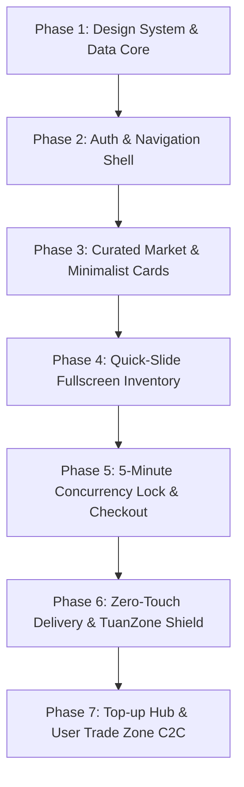

# Kế Hoạch Triển Khai Nền Tảng Thương Mại Điện Tử Gaming tuanzOne.com

Dự án xây dựng nền tảng thương mại điện tử chuyên biệt cho tài khoản game và dịch vụ game all-in-one mang tên **tuanzOne.com**, định hình phong cách **Cyber Esports Minimalist** với độ hoàn thiện cao, tập trung vào tốc độ giao dịch, trải nghiệm thị giác và bảo mật "không chạm" (Zero-touch).

---

## 1. Thiết Kế Nhận Diện Thương Hiệu & Trải Nghiệm (Design System)

- **Chủ đạo**: Cyber Esports Minimalist (Tối giản thể thao điện tử, phong cách vị lai).
- **Màu nền (Canvas)**: Đen than Obsidian (`#0b0d14` / `#10141f`).
- **Màu nhấn công nghệ (Accent & Glow)**: Neon Cyan (`#00f2fe`) kết hợp Electric Blue (`#4facfe`).
- **Nút hành động chính (CTA)**: Cam rực rỡ neon / Amber Blaze (`#ff5500` -> `#ff7a00`) tạo độ tương phản cực mạnh kích thích chuyển đổi.
- **Bề mặt (Surfaces)**: Glassmorphism cao cấp (kính mờ, blur 16px, viền kim loại xước mờ `rgba(255, 255, 255, 0.08)` và viền phát sáng cyan khi hover).
- **Typography**: Google Fonts hiện đại (Font tiêu đề công nghệ: `Outfit` / `Orbitron`, font hiển thị số liệu & nội dung: `Inter` / `JetBrains Mono`).

---

## 2. Phân Chia Giai Đoạn Thực Hiện (Phased Task Roadmap)

### Phase 1: Nền tảng Kiến trúc & Design System Core
- **Mục tiêu**: Thiết lập hệ thống biến CSS (Design Tokens), Typography, Grid responsive và mock database store linh hoạt.
- **Nhiệm vụ cụ thể**:
  - `styles/theme.css`: Cấu hình toàn bộ bảng màu Obsidian, Cyan Neon, Orange CTA, hiệu ứng kính mờ (frosted glass), viền xước và glow animation.
  - `data/games.js`: Bộ dữ liệu chuẩn cho 4 tựa game cốt lõi: Free Fire, FC Mobile, Liên Quân, Roblox (kèm màu sắc nhận diện đặc trưng cho từng phân khu game).
  - `data/mockAccounts.js`: Danh mục tài khoản mẫu với 3 thông số vàng (Rank, Top Item, Trạng thái liên kết), danh sách ảnh kho đồ chất lượng cao.
  - `js/store.js`: Quản lý State tập trung (User, Giỏ hàng/Khóa giữ chỗ, Bộ lọc, Lịch sử giao dịch).

### Phase 2: Shell Giao Diện, Header & Hệ Thống Xác Thực
- **Mục tiêu**: Xây dựng khung ứng dụng hoàn chỉnh, thanh điều hướng gaming hub và modal Đăng nhập / Đăng ký.
- **Nhiệm vụ cụ thể**:
  - `Header & Sub-header`: Logo `tuanzOne.com` phát sáng neon, widget số dư ví, chuông thông báo real-time, nút Đăng nhập / Đăng ký.
  - `Game Selector Tabs`: Thanh chuyển đổi phân khu game với hiệu ứng ánh sáng đổi màu theo game (Cam/Vàng cho Free Fire, Xanh sân cỏ neon cho FC Mobile, Xanh vương giả cho Liên Quân, Tím/Đỏ cho Roblox).
  - `Auth Modal`: Form đăng nhập / đăng ký tối giản, chuyển tab mượt mà, lưu trạng thái đăng nhập vào LocalStorage.

### Phase 3: Kho Acc Tuyển Chọn (Curated Market) & Thẻ Acc 3 Thông Số Vàng
- **Mục tiêu**: Hiển thị danh sách tài khoản chuẩn phong cách tối giản thể thao điện tử, tích hợp bộ lọc món đồ biểu tượng.
- **Nhiệm vụ cụ thể**:
  - **Thẻ sản phẩm chuẩn 3 Thông Số Vàng**:
    1. *Bậc Rank*: Huy hiệu Rank sắc nét (Thách Đấu, Tinh Anh, Huyền Thoại, FIFA Champion...).
    2. *Vũ khí / Trang phục VIP nhất*: Tag nổi bật (vd: `AK47 Rồng Xanh Lv7`, `Gullit ICON`, `Nakroth SS`, `Kitsune Perm`).
    3. *Tình trạng liên kết*: Huy hiệu xanh "Trắng thông tin 100%" hoặc cam "Đã liên kết (Có bảo hành)".
  - **Iconic Gear Filter (Bộ lọc 2-Click)**:
    - Chip chọn nhanh các trang phục/vũ khí hot meta theo từng game. Người dùng chỉ cần click 1 món là lọc ngay không cần gõ tìm kiếm.
  - **Bộ lọc bổ trợ**: Lọc theo tầm giá, bậc rank, phương thức liên kết.

### Phase 4: Trình Xem Kho Đồ Toàn Màn Hình (Quick-Slide Inventory Story)
- **Mục tiêu**: Trải nghiệm xem trước tài khoản không ngắt quãng trải nghiệm lướt web.
- **Nhiệm vụ cụ thể**:
  - Modal toàn màn hình dạng Instagram Story / Carousel với animation mượt mà.
  - Thanh tiến trình (progress bar) hiển thị số lượng ảnh kho đồ (vũ khí, nhân vật, bảng ngọc, thông tin tài khoản).
  - Điều khiển linh hoạt: Chạm/Click hai bên trái/phải, phím mũi tên bàn phím, vuốt swipe trên mobile.
  - Nút "Khóa giữ chỗ & Mua ngay" ghim cố định với hiệu ứng neon pulse.

### Phase 5: Cơ Chế Khóa Giao Dịch 5 Phút (5-Minute Lock) & Thanh Toán
- **Mục tiêu**: Ngăn chặn tình trạng tranh mua đồng thời (race condition / double-spending).
- **Nhiệm vụ cụ thể**:
  - Khi ấn "Mua ngay", tài khoản lập tức chuyển trạng thái sang `LOCKED (Đang giữ chỗ)` trong 5:00 phút.
  - Hiển thị thanh đếm ngược visual cyber timer. Các người dùng khác nhìn thấy thẻ sẽ bị mờ và hiển thị "Đang có giao dịch giữ chỗ".
  - Nếu sau 5 phút không hoàn tất thanh toán, hệ thống tự động giải phóng trạng thái về `AVAILABLE`.
  - Giả lập cổng thanh toán QR Code (VietQR chuẩn động) kèm nút thanh toán tức thì bằng số dư ví.

### Phase 6: Bàn Giao Tự Động Không Chạm (Zero-Touch) & TuanZone Shield
- **Mục tiêu**: Tự động hóa hoàn toàn việc xuất nick và cơ chế bảo vệ quyền lợi người mua.
- **Nhiệm vụ cụ thể**:
  - **Zero-touch Delivery Modal**:
    - Khi thanh toán thành công, hệ thống bung ngay cửa sổ bàn giao bảo mật: Tài khoản, Mật khẩu, Mã dự phòng 2FA, Email liên kết.
    - Nút 1-Click Copy từng thông số và nút "Tải file hướng dẫn bảo mật (.txt/pdf)".
  - **TuanZone Shield Tracker**:
    - Đồng hồ bảo hành 24 giờ đếm ngược trực quan trong lịch sử đơn hàng.
    - Nút "Kích hoạt bảo hành / Yêu cầu đổi trả 100% hoàn tiền ví" nếu có sai lệch so với ảnh mô tả.
  - **Verified Reviews (Đánh giá xác thực)**:
    - Tab đánh giá chỉ mở khóa cho tài khoản đã có trạng thái đơn hàng `COMPLETED`. Chấm sao, gửi ảnh thực tế và huy hiệu "Người mua xác thực".

### Phase 7: Hệ Sinh Thái Mở Rộng - Trạm Nạp Tự Động & Ký Gửi C2C (User Trade Zone)
- **Mục tiêu**: Hoàn thiện định vị All-in-One Gaming Hub.
- **Nhiệm vụ cụ thể**:
  - **Trạm Nạp Tự Động (Top-up Hub)**:
    - Form nhập ID Ingame và Tên máy chủ/Server.
    - Danh sách gói nạp Kim Cương (Free Fire), Quân Huy (Liên Quân), FC Points (FC Mobile), Robux (Roblox) kèm chiết khấu tự động (5% - 15%).
  - **Ký Gửi Tài Khoản (User Trade Zone)**:
    - Giao diện cho phép user đăng bán tài khoản: tải ảnh, nhập 3 thông số vàng, định giá.
    - Tự động tính phí sàn trung gian (5% - 7%) hiển thị minh bạch cho người bán.
    - Cơ chế sàn giữ tiền trung gian (Escrow) đảm bảo an toàn 100%.

---

## 3. User Review Required

> [!IMPORTANT]
> **Lựa chọn Tech Stack triển khai mẫu (Interactive Prototype vs Full Framework):**
> 1. **Option A (Khuyến nghị để review trực quan nhanh, siêu mượt, không phụ thuộc môi trường build nặng)**: Xây dựng Single Page App thuần (HTML5, Vanilla CSS kiến trúc hiện đại, JavaScript ES6+ Modular). Chạy mượt mà trực tiếp trên mọi trình duyệt, dễ dàng kiểm thử toàn bộ UI/UX, Story modal, 5-minute lock, Zero-touch modal.
> 2. **Option B**: Sử dụng Vite + React / Next.js nếu bạn định hướng kết nối trực tiếp với backend NodeJS/NestJS/Go sau này.

> [!TIP]
> Toàn bộ logic giao dịch (5-minute lock, Zero-touch credentials, TuanZone Shield 24h timer, Top-up rate) sẽ được xây dựng mô phỏng với LocalStorage State để có thể trải nghiệm thực tế ngay lập tức.

---

## 4. Kế Hoạch Kiểm Thử (Verification Plan)

### Kiểm thử Giao diện & Trải nghiệm (UI/UX)
- Kiểm tra độ tương phản màu chuẩn WCAG trên nền đen Obsidian `#0b0d14` với Cyan Neon và Cam CTA.
- Kiểm tra tính năng Quick-Slide Story modal với phím mũi tên và click.
- Kiểm tra tính trực quan của thẻ 3 thông số vàng (Rank, VIP item, Tình trạng thông tin).

### Kiểm thử Luồng Nghiệp vụ (Business Logic)
- **5-Minute Concurrency Lock**: Kích hoạt nút mua -> kiểm tra đồng hồ 5 phút đếm ngược -> kiểm tra trạng thái khóa ở tab khác / session khác.
- **Zero-touch Delivery**: Thanh toán đơn -> kiểm tra thông tin đăng nhập xuất hiện ngay lập tức kèm hướng dẫn bảo mật.
- **TuanZone Shield**: Kiểm tra đồng hồ bảo hành 24h và form khiếu nại hoàn tiền.
- **Iconic Gear Filter**: Bấm chọn 1 món trang phục biểu tượng -> danh sách nick tự động lọc chính xác chỉ sau 1-2 click.
